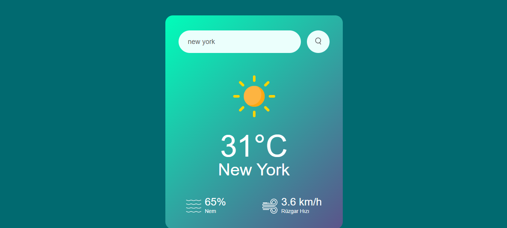
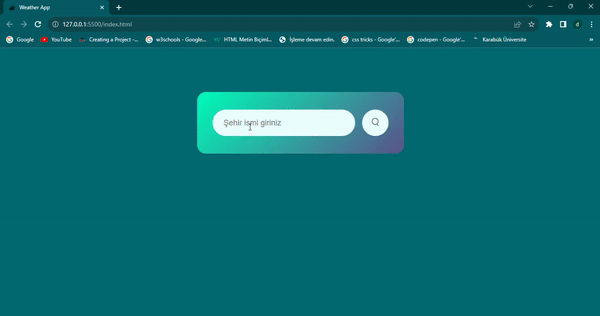

# WeatherApp

🚀 Yeni Proje Lansmanı: Hava Durumu Uygulaması! 💻
Bugün sizlerle heyecan verici bir projeyi paylaşmak istiyorum. Axios ile weather app API'sini kullanarak geliştirdiğim "Hava Durumu" uygulamasını tamamladım! 🌐🔍
Bu projenin amacı, Ülke-Şehir isimlerini hızlıca girerek o ülkenin hava durumu bilgilerini görüntülemelerine ve hızlı bir şekilde önlem almalarına olanak tanımaktır. 
Öne Çıkan Özellikler:
💻 Ülke-Şehir Bilgileri: Ülke-Şehir adı girildiğinde, hava durumu, nem, rüzgar hızı sayıları görüntülenir.

Bu proje, hem Axios ve API entegrasyonu konularında becerilerimi geliştirmemi sağladı hem de kullanıcıların GitHub profillerini daha kolay incelemelerine yardımcı oldu.
Eğer projem hakkında daha fazla bilgi almak, görüşlerinizi paylaşmak veya gelecekteki projelerim hakkında konuşmak isterseniz, lütfen durmusozgul66@gmail.com benimle iletişime geçin.
Kişisel projelerim benim için önemlidir, umarım bu uygulama da size fayda sağlar! 🌟🚀
#WebDevelopment #GitHubAPI #Axios #Frontend #Projelerim #APIEntegrasyonu

<h2>Ekran gif</h2>

